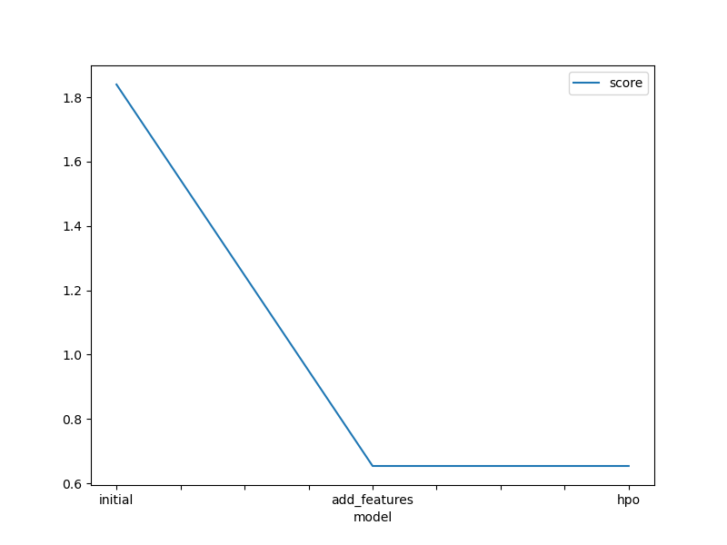
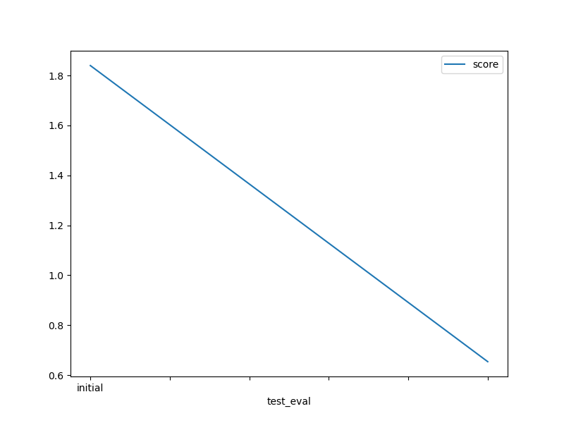

# Report: Predict Bike Sharing Demand with AutoGluon Solution
#### Saurav Verma

## Initial Training
### What did you realize when you tried to submit your predictions? What changes were needed to the output of the predictor to submit your results?
TODO: I verified that the predictions do not contain any negative values. The describe() method showed that there were none, hence I did not have to make any changes.

### What was the top ranked model that performed?
TODO: The second model was the highest ranked where I added a new feature for hour

## Exploratory data analysis and feature creation
### What did the exploratory analysis find and how did you add additional features?
TODO: From exploratory analysis I found that demand varies widely one the basis of the day being a holiday. I also noticed that the demand varies accros different hours of the day, so decided to split the datetime column and create a separate hour column and use it as a feature for training

### How much better did your model preform after adding additional features and why do you think that is?
TODO: After adding a new feature, kaggle submission score changed from 1.84007 to 0.65387. It happened due to the addition of a new feature hour, and it helped wih more accurate predictions of bike usage during hours.

## Hyper parameter tuning
### How much better did your model preform after trying different hyper parameters?
TODO: It did not perform any better than the model without hyperparameter tuning

### If you were given more time with this dataset, where do you think you would spend more time?
TODO: I would spend more time in exploring more features to add for model training, like months, weekdays etc

### Create a table with the models you ran, the hyperparameters modified, and the kaggle score.
|model|hpo1|hpo2|hpo3|score|
0	initial	1.84007	1.84007	1.84007	1.84007
1	add_features	0.65378	0.65378	0.65378	0.65378
2	hpo	0.65378	0.65378	0.65378	0.65378

### Create a line plot showing the top model score for the three (or more) training runs during the project.

TODO: Replace the image below with your own.

### Create a line plot showing the top kaggle score for the three (or more) prediction submissions during the project.

TODO: Replace the image below with your own.

## Summary
TODO: Adding hour to the feature improved model performance. More research can be done in exloring other features - like weekday, months.
